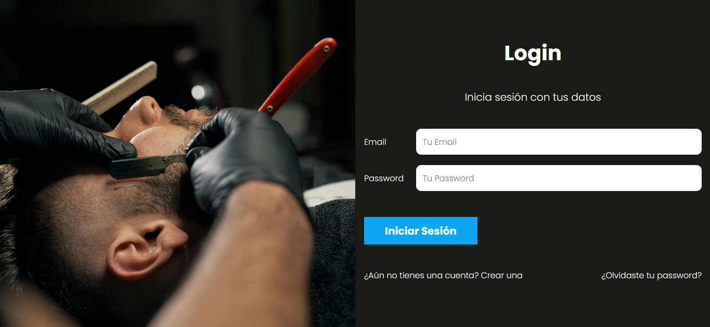
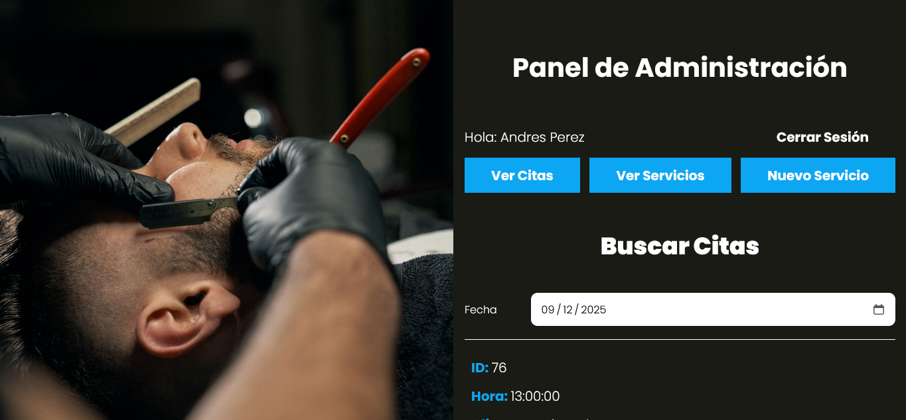

# 💇‍♀️ AppSalon_MVC

AppSalon_MVC es una aplicación web desarrollada para la gestión de citas en un salón de belleza. Este proyecto utiliza el patrón de diseño MVC (Modelo-Vista-Controlador) y está construido con PHP, JavaScript, SASS y otras tecnologías modernas. La aplicación permite a los usuarios registrarse, iniciar sesión, programar citas, y gestionar servicios de manera eficiente.

---

## 🚀 Características

- **Gestión de usuarios**: Registro, inicio de sesión y recuperación de contraseñas.
- **Gestión de citas**: Crear, actualizar y eliminar citas.
- **Gestión de servicios**: Crear, actualizar y eliminar servicios del salón.
- **Notificaciones por correo electrónico**: Confirmación de cuenta y recuperación de contraseñas.
- **Interfaz moderna**: Diseñada con SASS para un diseño atractivo y responsivo.
- **Seguridad**: Uso de variables de entorno y validación de datos.

---

## 🛠️ Tecnologías utilizadas

- **Backend**:
  - PHP 8+
  - MySQL
  - PHPMailer
  - Composer
- **Frontend**:
  - HTML5
  - CSS3 (SASS)
  - JavaScript (ES6+)
- **Herramientas**:
  - Gulp
  - Mailtrap (para pruebas de correo electrónico)
  - Dotenv (manejo de variables de entorno)

---

## 📂 Estructura del proyecto

```
AppSalon_MVC/
├── classes/          # Clases principales del proyecto
├── controllers/      # Controladores para manejar la lógica de negocio
├── includes/         # Archivos de configuración y utilidades
├── models/           # Modelos para interactuar con la base de datos
├── public/           # Archivos públicos (CSS, JS, imágenes)
├── src/              # Archivos fuente (SASS, JS)
├── vendor/           # Dependencias instaladas con Composer
├── views/            # Vistas del proyecto
├── .env              # Variables de entorno
├── composer.json     # Configuración de Composer
├── gulpfile.js       # Configuración de Gulp
└── README.md         # Este archivo
```

---

## 📦 Instalación

Sigue estos pasos para instalar y ejecutar el proyecto en tu máquina local:

1. **Clona el repositorio**:

   ```bash
   git clone https://github.com/Melomario57/AppSalon_MVC.git
   cd AppSalon_MVC
   ```

2. **Instala las dependencias de PHP**:

   ```bash
   composer install
   ```

3. **Instala las dependencias de Node.js**:

   ```bash
   npm install
   ```

4. **Configura las variables de entorno**:
   Crea un archivo `.env` en la raíz del proyecto y configura las variables necesarias (puedes usar el archivo `.env` de ejemplo).

5. **Compila los archivos SASS y JavaScript**:

   ```bash
   gulp
   ```

6. **Configura la base de datos**:

   - Crea una base de datos en MySQL.
   - Importa el archivo `database.sql` (si está disponible).
   - Configura las credenciales de la base de datos en el archivo `.env`.

7. **Inicia el servidor**:
   - Si estás usando un servidor local como XAMPP o WAMP, coloca el proyecto en la carpeta `htdocs`.
   - Accede a la aplicación desde tu navegador en `http://localhost/AppSalon_MVC`.

---

## 🌟 Uso

1. **Registro de usuarios**:

   - Los usuarios pueden registrarse proporcionando su correo electrónico y nombre.
   - Recibirán un correo de confirmación para activar su cuenta.

2. **Gestión de citas**:

   - Los usuarios pueden programar citas seleccionando servicios y horarios disponibles.

3. **Gestión de servicios**:
   - Los administradores pueden agregar, editar o eliminar servicios desde el panel de administración.

---

## 📧 Notificaciones por correo

El proyecto utiliza **PHPMailer** para enviar correos electrónicos. Asegúrate de configurar correctamente las credenciales de tu servidor SMTP en el archivo `.env`:

```dotenv
EMAIL_HOST=sandbox.smtp.mailtrap.io
EMAIL_USER=tu_usuario
EMAIL_PASSWORD=tu_contraseña
EMAIL_PORT=2525
```

## Despliegue en bytehost

### https://appsalon.22web.org/

### Credenciales

### correo@correo.com 123456 (usuario)

### correo@correo.com 654321 (admin)

## 🖼️ Capturas de pantalla

### Página de inicio



### Panel de administración



## 🧑‍💻 Autor

- **Nombre**: Melomario57
- **GitHub**: [Melomario57](https://github.com/Melomario57)

---

## 📝 Licencia

Este proyecto está bajo la licencia **MIT**. Consulta el archivo `LICENSE` para más detalles.

---

## ⭐ Agradecimientos

- A todos los desarrolladores que contribuyeron a las herramientas utilizadas en este proyecto.
- A la comunidad de Udemy por el curso que inspiró este proyecto.
